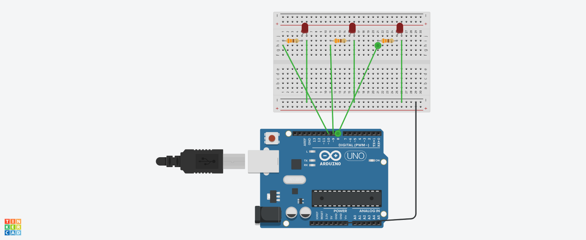

# Arduino Workshop

**Maintainer: Naksh Rathore**<br />
**Date created: July 21st, 2025**

## Overview
Have you ever wanted to build cool stuff, but realized it was too hard! Me too, especially the programming side! That's why I decided to help me and everyone else out by making this **Arduino Workshop**!<br />
This repository is a collection of simple Arduino projects, perfect to teach **beginners** and great if you want to **practice** your Arduino skills without making a big project.<br />
This includes many short examples about different components to get you started building, to learn by doing! Each example contains the `.ino` **code** and a **schematic** so you can do this project too.

## How to use

### Step 1
Run `git clone https://github.com/Naksh-Rathore/arduino_workshop`

### Step 2
Run `cd <example>`

### Step 3
Recreate the schematic<br />

Example:<br /> 


### Step 4
Run the code<br />

Example:<br />
```cpp
void cycleLight(int pin) {
  digitalWrite(pin, HIGH);
  delay(250);
  digitalWrite(pin, LOW);
}

void setup() {
  // put your setup code here, to run once:

  for (int i = 8; i <= 10; i++) {
    pinMode(i, OUTPUT);
  }
}

void loop() {
  // put your main code here, to run repeatedly:

  for (int i = 8; i <= 10; i++) {
    cycleLight(i);
  }
}
```

### Step 5
Modify and test!

## Have Fun!
